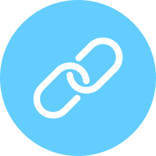

# Shortcut plugin for Craft CMS 3.x

Simple URL shortening



## Requirements

This plugin requires Craft CMS 3.0.0-beta.23 or later.

## Installation

To install the plugin, follow these instructions.

1. Open your terminal and go to your Craft project:

        cd /path/to/project

2. Then tell Composer to load the plugin:

        composer require superbig/craft3-shortcut

3. In the Control Panel, go to Settings → Plugins and click the “Install” button for Shortcut.

## Shortcut Overview

Let's you create short links for elements or arbitrary URLs.

## Using Shortcut

To create a short url for a element:
```twig

{{ shortcut.getUrl() }}
```

To create a short url for a url:
```twig

{{ shortcut.getUrl() }}
```

By default, short urls is in the format `xxxx.tld/s/aBC123`. If you want to change the url segment from `s` to something custom, you can add a config file called shortcut.php in craft/config to override it:

```php
<?php
return [
    // Override Shortcut URL segment
    'urlSegment' => 'x',
];
```

If you want to remove the url segment completely and get urls like `xxxx.tld/aBC123`, you can enable the `hideUrlSegment` option.

```php
<?php
return [
    // Hide url segment
    'hideUrlSegment' => true,
];
```

To use a custom domain, add the domain with the `customDomain` option.

```php
<?php
return [
    // Set custom domain
    'customDomain' => 'https://cool.domain',
];
```

Brought to you by [Superbig](https://superbig.co)
